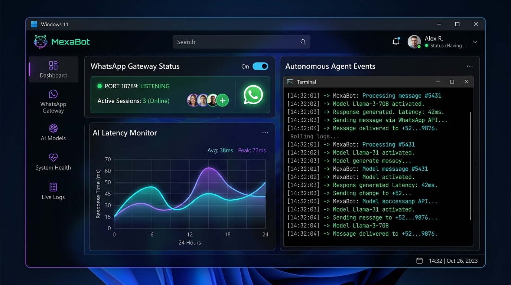
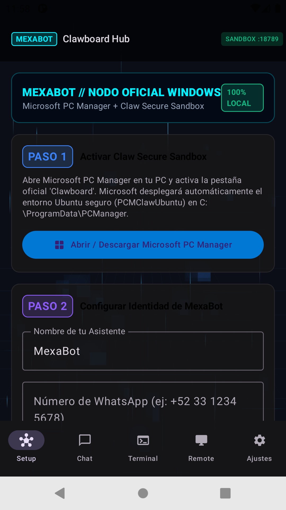

# 🌐 MEXABOT.AI — Ecosistema Autónomo Multiplataforma On-Premise

[](https://opensource.org/licenses/MIT)
[](https://microsoft.com)
[](https://ai.google.dev)
[](http://127.0.0.1:18789)

**MexaBot** es una suite empresarial de automatización comercial e inteligencia artificial autónoma diseñada para operar de forma **100% On-Premise** (localmente en la computadora o infraestructura del cliente). Transforma WhatsApp, Telegram y la web en una central 24/7 de ventas, agendamiento de citas y soporte técnico sin programar una sola línea de código y con absoluta privacidad de datos.

---

## 📸 Capturas de Pantalla & Experiencia de Usuario

| MexaBot Desktop Suite (Windows 11 Fluent OS) | MexaBot Mobile (Android Nativo Jetpack Compose) |
| :---: | :---: |
|  |  |

---

## 🏗️ Arquitectura del Sistema

El ecosistema opera bajo una arquitectura modular y desacoplada de 4 capas:

```
                               ┌────────────────────────────────────────┐
                               │       MEXABOT ECOSYSTEM ARCHITECTURE   │
                               └──────────────────┬─────────────────────┘
                                                  │
          ┌───────────────────────────────────────┼───────────────────────────────────────┐
          │                                       │                                       │
          ▼                                       ▼                                       ▼
┌──────────────────┐                    ┌──────────────────┐                    ┌──────────────────┐
│  FRONTEND & WEB  │                    │  KERNEL & DAEMON │                    │ MEXABOT MOBILE   │
│  Command Deck    │                    │  Gateway Local   │                    │ Jetpack Compose  │
│  HUD Interactivo │                    │  Directiva SOUL  │                    │ Monitor de Nodos │
│  Auto-Discovery  │                    │  Motor WhatsApp  │                    │ Terminal en Vivo │
└──────────────────┘                    └──────────────────┘                    └──────────────────┘
```

### Componentes Principales:
1. **Frontend Web & Command Deck (`index.html`, `styles.css`, `app.js`):**
   - Interfaz Cyberpunk OLED responsive con auto-margen y adaptación fluida a smartphones, tablets y pantallas de escritorio.
   - Motor **Smart Auto-Discovery**: detecta de forma autónoma si el Gateway local ya está activo en la máquina y sincroniza la telemetría en tiempo real a 60 FPS.
   - Simulador interactivo del menú comercial de 5 opciones con pasarela de pago seguro integrada.

2. **Núcleo de Inferencia & Directiva Maestra (`SOUL.md`):**
   - 4 Arquetipos de negocio preconfigurados: **Aura** (Ventas y Cierre 24/7), **Cronos** (Citas & Calendario), **Atlas** (Helpdesk RAG) y **Nova** (Copiloto Ejecutivo).
   - **Enrutamiento Determinista Dual**: Canal personal del propietario con Copiloto privado de Gemini vs. canales comerciales públicos para clientes y prospectos.
   - **Regla Estricta Inbound & No Intervención en Chats Humanos**: Silencio total y automático en conversaciones iniciadas manualmente por el usuario.

3. **MexaBot Desktop Suite para Windows (`windows-store-package/`, `releases/windows/`):**
   - Aplicación de escritorio nativa para Windows 11 y 10 con aceleración por hardware, control de ventana frameless y servicio en segundo plano.
   - Paquete de distribución oficial verificado con certificado digital y manifiesto de seguridad.

4. **MexaBot Mobile para Android (`android/`):**
   - Aplicación nativa en **Kotlin + Jetpack Compose** con diseño Cyberpunk y Perspective Grid.
   - Módulo Clawboard Hub con terminal interactiva de comandos, monitoreo de sockets y gestión de emparejamiento.

---

## 📁 Estructura del Repositorio

```text
d:\Mexabot/
├── android/                         # Aplicación nativa Android (Kotlin + Jetpack Compose)
│   ├── app/src/main/java/           # UI Cyberpunk, Perspective Grid, Clawboard Hub y Terminal
│   └── app/build/outputs/apk/       # APKs oficiales ensamblados
├── windows-store-package/           # Recursos y manifiesto oficial de la aplicación de escritorio
│   ├── Assets/                      # Set completo de 21 íconos y splash screens oficiales
│   └── Package.appxmanifest         # Manifiesto de capacidades y seguridad del cliente Windows
├── releases/                        # Entregables y paquetes de distribución
│   ├── android/                     # APK oficial de MexaBot Mobile
│   ├── windows/                     # Paquetes oficiales para Windows
│   └── scripts/                     # Scripts de auto-instalación en 1 clic
├── index.html                       # Consola Web & Command Deck Cyberpunk
├── styles.css                       # Sistema de diseño con tokens OLED y auto-margen responsive
├── app.js                           # Motor de Auto-Discovery y simulador interactivo
├── SOUL.md                          # Directiva Maestra sanitizada para despliegue distribuido
├── analisis_mexabot_mercado_valuacion.md # Reporte ejecutivo y valuación técnica ($162,000 MXN)
└── README.md                        # Documentación técnica maestra
```

---

## 🚀 Despliegue & Puesta en Marcha

### 1. Consola Web & Command Deck
```bash
# Iniciar servidor local
npm start
# O con Python:
python -m http.server 8000
```
Accede desde el navegador: [http://127.0.0.1:8000](http://127.0.0.1:8000)

### 2. Cliente de Escritorio (Windows)
Ejecuta el instalador oficial o lanza el cliente de escritorio desde la carpeta `releases/windows/`. La aplicación detectará automáticamente el Gateway local y enlazará las sesiones activas en segundos.

### 3. Cliente Móvil (Android)
Instala el archivo APK disponible en `releases/android/` para monitorear el estado del agente, los registros de inferencia y la actividad en tiempo real desde tu dispositivo móvil.

---

## 🛡️ Seguridad, Privacidad & Modelo Comercial

- **Privacidad Absoluta On-Premise:** Los datos, contactos y memoria del bot nunca abandonan la máquina local del cliente.
- **Sin Datos Sensibles Hardcodeados:** El código base es 100% modular y agnóstico, empleando variables dinámicas de entorno para que cada instalación sea independiente.
- **Planes Comerciales Disponibles:**
  - **Plan Inicial / Profesionista:** $2,490 MXN setup · $790 MXN/mes.
  - **Plan Empresa / Multi-Agente:** $4,990 MXN setup · $1,490 MXN/mes.
  - **Plan Corporativo Llave en Mano:** $9,990 MXN setup · $2,990 MXN/mes.
  - Pasarela oficial de pago seguro vía PayPal: [`paypal.me/DixLqb`](https://paypal.me/DixLqb).

---

## 🌐 Enlaces Oficiales

- **Portal Web Oficial:** [https://dixi3stdgdl-design.github.io/Mexabot/](https://dixi3stdgdl-design.github.io/Mexabot/)
- **Control UI Local:** [http://127.0.0.1:18789/](http://127.0.0.1:18789/)

---

© 2026 MEXABOT. Ingeniería, arquitectura y desarrollo por **Octavio García**. Todos los derechos reservados.
