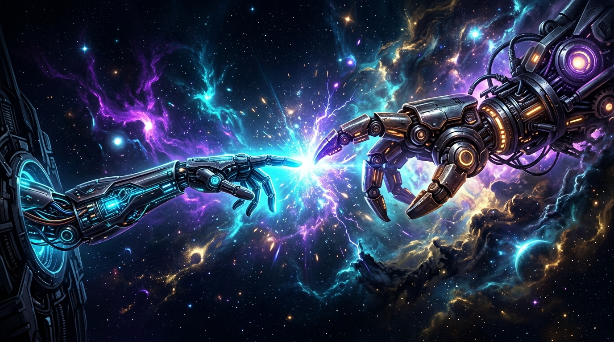

# MEXABOT — Suite de Asistentes Digitales Autónomos

Plataforma no-code para el despliegue determinista y orquestación de agentes de IA en **WhatsApp Business**, **Telegram** y ecosistemas empresariales.



---

## 🚀 Características Principales

- **Instalación 100% Determinista:** Automatización completa con OpenClaw y activación de ClawBoard en PC Manager.
- **Emparejamiento de Hardware Seguro:** Protocolos certificados con *Enlace Móvil de Windows (Phone Link)* y *Depuración USB (ADB)* para 99.8% de disponibilidad.
- **Matriz de Cómputo por Volumen:** Dimensionamiento técnico desde 1 a 1,000+ usuarios concurrentes.
- **Inferencia Gemini Flash Core:** Comprensión semántica profunda, calificación automática de prospectos y respuestas en 2-4 líneas optimizadas para móvil.
- **Aislamiento de Credenciales:** Inyección directa de `env.GEMINI_API_KEY` para evitar bloqueos de SQLite y garantizar privacidad de datos.

---

## 📁 Estructura del Repositorio

```text
├── index.html               # Aplicación web y landing page interactiva
├── styles.css               # Diseño minimalista con tokens de diseño sobrios
├── app.js                   # Orquestador visual, timeline y simulador sandbox
├── hero-creation-claw.jpg   # Arte fotorrealista (La Creación de la Inteligencia)
└── README.md                # Documentación técnica del proyecto
```

---

## 🌐 Ver en Vivo

- **Sitio Web Oficial:** [https://dixi3stdgdl-design.github.io/Mexabot/](https://dixi3stdgdl-design.github.io/Mexabot/)
- **Motor de Orquestación:** OpenClaw Gateway en puerto `18789`.

---

© 2026 MEXABOT. Todos los derechos reservados.
